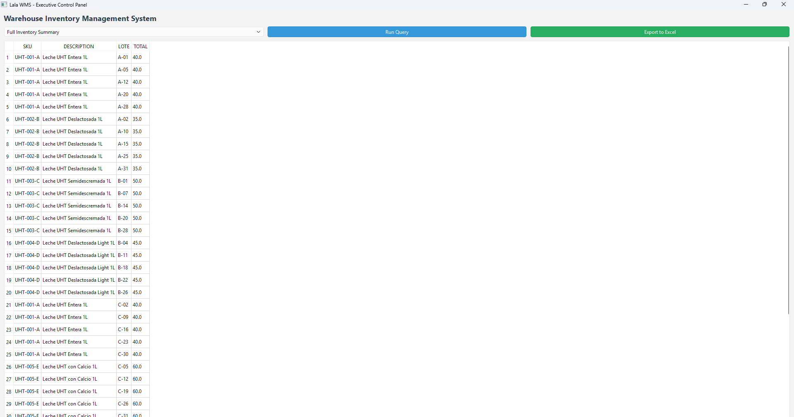
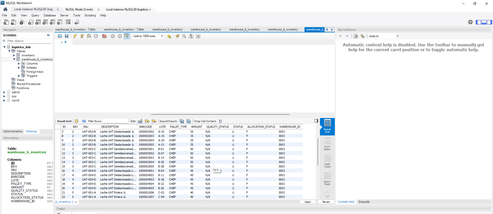
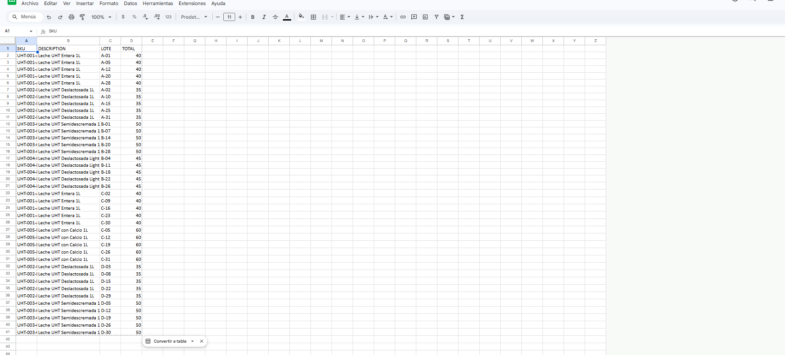

# Lala-WMS-Inventory-Core
# 🥛 Lala WMS - Executive Inventory Control System

Este proyecto es un núcleo de **Sistema de Gestión de Almacenes (WMS)** diseñado específicamente para la logística de productos lácteos UHT. La aplicación automatiza el seguimiento de inventarios, proporciona visualización de datos en tiempo real y genera reportes ejecutivos automatizados.

## 🛠️ Stack Tecnológico
* **Lenguaje:** Python 3.x
* **Framework GUI:** PyQt6 (Interfaz profesional de escritorio)
* **Base de Datos:** MySQL (Arquitectura relacional)
* **Análisis de Datos:** Pandas
* **Reporting:** Exportación automatizada a Excel/Google Sheets con KPIs

## 📊 Lógica de Negocio y Trazabilidad
El sistema implementa una lógica profesional de **Control de Lotes Alfanuméricos** para garantizar la frescura y el cumplimiento de estándares de calidad:
* **Formato de Lote:** `[Código_Mes]-[Día]` (Ejemplo: `A-15` = 15 de Enero).
* **Control de Cuarentena:** Filtrado integrado para pallets bloqueados (Locked) por control de calidad.
* **Dashboard de KPIs:** Cálculo automático de totales de stock y utilización de bahías de carga.

## 🚀 Estructura del Proyecto
* `wms_dashboard.py`: Código principal de la interfaz y lógica de conexión.
* `data/setup_database.sql`: Scripts de creación de esquemas y carga masiva de 100 registros de prueba.
* `images/`: Evidencias visuales del funcionamiento del sistema.
* `requirements.txt`: Dependencias del proyecto.

## 📸 Evidencia de Funcionamiento

### Interfaz de Usuario (PyQt6)

### Auditoría de Base de Datos (MySQL Workbench)

### Reportes Ejecutivos Generados

## ⚙️ Instalación y Configuración
1.  Clonar el repositorio.
2.  Ejecutar el script `data/setup_database.sql` en su servidor MySQL local.
3.  Instalar dependencias: `pip install -r requirements.txt`
4.  Configurar credenciales en el diccionario `db_config` dentro del script principal.
5.  Ejecutar: `python wms_dashboard.py`

---
**Desarrollado por:** Javier Martínez Andrade  
*Especialista en Automatización Logística y Análisis de Datos*
